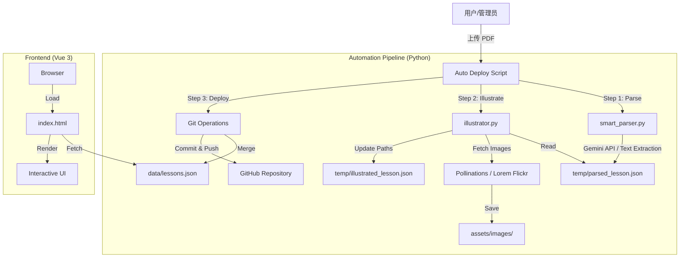

# 🏗️ Architecture Design (技术架构)

本文档记录了 `primary-school-fun-learning` 项目的技术演进与架构设计决策。

## 1. 系统架构图

## 2. 关键模块设计

### 2.1 数据结构 (`data/lessons.json`)
采用扁平化 JSON 数组存储，每个元素代表一节课 (Lesson)。
支持多态结构：
- **Chinese Lesson**: 包含 `vocabulary` (生字+图片), `sentences` (课文).
- **Math Lesson (Geometry)**: 包含 `shapes` (图形定义).
- **Math Lesson (Arithmetic)**: 包含 `formulas`, `key_concepts`.

### 2.2 容错与无 Key 模式
为了适应开发环境（如 OpenClaw 无 Auth 注入），脚本设计了多级降级策略：
1.  **解析降级**: 如果 Gemini API 失败 -> 检查 `temp/parsed_lesson.json` 是否存在（支持手动/Agent 辅助生成）。
2.  **配图降级**: 如果 OpenAI/Pollinations 失败 -> 自动切换至 Lorem Flickr 搜索图 -> 如果仍失败 -> 使用文字占位符。
3.  **去重机制**: 在合并数据时，基于 `title` 进行去重。如果标题已存在，则**更新**原有记录（保留 ID），防止数据膨胀。

### 2.3 前端适配
`index.html` 使用 Vue 3 的条件渲染 (`v-if`) 处理不同类型的课程：
- `v-if="subject === 'Chinese'"`: 显示田字格、背诵模式。
- `v-if="subject === 'Math'"`: 
    - 子判断: 有 `shapes` -> 渲染 Canvas。
    - 子判断: 否则 -> 渲染公式卡片。

## 3. 技术演进历史
- **v1.0**: 纯手动编辑 JSON，图片需手动下载。
- **v2.0**: 引入 `pdf2image` + OCR，流程复杂且不稳定。
- **v2.5 (Current)**: 
    - 引入 Gemini 3.0 Pro 原生 PDF 解析。
    - 引入 `illustrator.py` 自动化配图队列。
    - 支持批量解析（JSON List）。

## 4. 未来规划
- **Audio TTS**: 为生字和课文自动生成 MP3 音频。
- **User Progress**: 利用 `localStorage` 记录用户的学习进度（已背诵/已掌握）。
